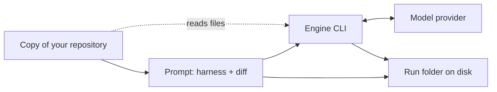

# What sentinel sends and stores

Know what leaves your machine during a review and what stays on your disk.

## 1. What is sent

For each review, sentinel builds one prompt and hands it to the engine you chose (Claude Code or OpenCode). The prompt holds:

- the harness instructions
- the skills the harness lists
- the answer format, when the harness has one
- the diff of the branch against its base branch
- the output of the repository's check commands, when you set any up

The engine CLI sends the prompt to its model provider, under that tool's own account and settings. sentinel does not talk to the provider itself.

## 2. What the engine can read

The engine runs inside a temporary copy of the branch you are reviewing, so it can read the files there, not only the diff. sentinel removes that copy when the review ends.

- OpenCode: sentinel blocks file edits, shell commands and web fetches.
- Claude Code: it runs with your own Claude Code permission settings. sentinel adds no limits of its own.

## 3. What stays on your disk

Everything is under your sentinel folder (`~/.sentinel`, see the [Quick start](quick-start.md)):

- `~/.sentinel/clones/`: a full copy of each repository you registered.
- `~/.sentinel/runs/`: one folder per review, the `runDir` that the review prints.

Every review that started keeps its folder, whatever its outcome, until you delete it. What the folder holds depends on how far the review got:

- `metadata.json`: the details of the run
- `prompt.md`: the prompt as sent, which includes the diff
- `result.md`: the engine's answer, only when the engine gave one
- `validations/`: the output of the check commands, only when some ran

A review that sentinel refuses to start, for example when `--type` is missing, keeps nothing.

## 4. What sentinel itself sends

Only git traffic: sentinel downloads the repository with git when you add it, and fetches from it when interactive mode lists branches. It makes no other network calls and sends no usage data.

## 5. Credentials

sentinel stores no passwords or tokens. git uses your own git setup, and the engine uses its own login.

## Next steps

- [Quick start](quick-start.md)
- [Build your own harness](build-your-own-harness.md)
