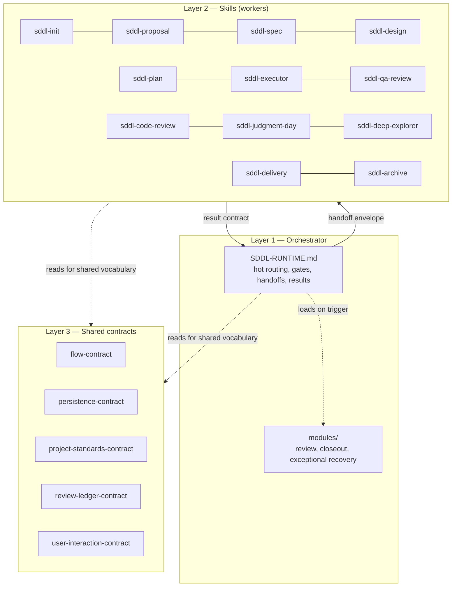

# sdd-lite — Architecture

Other docs: [orchestrator.md](./orchestrator.md) · [flow.md](./flow.md) · [skills.md](./skills.md) · [review-protocols.md](./review-protocols.md) · [config-and-state.md](./config-and-state.md)

Technical reference for how `sdd-lite` is built. For how to *use* it, see `../USER-GUIDE.md`.

## Philosophy

`sdd-lite` is a compressed spec-driven-development lifecycle for bounded changes: explicit bootstrap, persisted artifacts instead of chat memory, one approved execution stage at a time, and a single QA skill covering both stage review and final closeout.

It is not a rebrand of the OpenSpec tool. `openspec/` here is just the name of the artifact subtree under `./sdd-lite/` — there is no dependency on, or integration with, an external OpenSpec project. A root-level `openspec/` is never used.

Core operating principle: **the orchestrator stays thin**. It routes; it does not implement. Real stage work always runs in a fresh worker (a delegated skill invocation), never inline in the orchestrator's own context.

## Three layers



**Layer 1 — Orchestrator.** `orchestrator/SDDL-RUNTIME.md` is the main-session event loop: read minimal persisted evidence, decide the next stage, build a compact handoff, dispatch, process the result, repeat. It loads one normative module only when review, combined closeout, or exceptional recovery is active. See [orchestrator.md](./orchestrator.md).

**Layer 2 — Skills.** Twelve `SKILL.md` files under `skills/sddl-*/`. Each is a phase executor: it receives a handoff envelope, does one bounded unit of work, writes its own owned artifact(s), and returns a structured result. Skills never become nested orchestrators and never launch sub-agents themselves. Host CLI adapters under `templates/agents/` choose model, effort, and tools; they do not copy skill algorithms. Two skills (`sddl-code-review`, `sddl-judgment-day`) are protocols the orchestrator executes directly rather than linear stages — their lens/judge workers are read-only and the orchestrator itself writes `review-ledger.md`. See [skills.md](./skills.md) and [review-protocols.md](./review-protocols.md).

**Layer 3 — Shared contracts.** Five documents under `skills/_shared/` that fix vocabulary so the twelve skills do not drift independently:

- `sddl-flow-contract.md` — canonical objective/route/stage ids, lifecycle states, worker handoff controls, and the common result-contract shape
- `sddl-persistence-contract.md` — canonical file paths, artifact ownership, naming rules
- `sddl-project-standards-contract.md` — how project conventions and quality commands are represented and injected
- `sddl-review-ledger-contract.md` — the findings row shape, severity model, and id/status rules shared by both review protocols
- `sddl-user-interaction-contract.md` — checkpoint types and their minimum content

Skills read these contracts as a fallback only. The preferred path is that the orchestrator already injected a compact `## Project Standards (auto-resolved)` block into the handoff, so a skill does not need to open all five files on every run. See [config-and-state.md](./config-and-state.md) for what each contract covers.

## Package layout

```text
harness/stable/sdd-lite/
  README.md
  USER-GUIDE.md / USER_GUIDE_ES.md
  docs/                        # this technical documentation
  orchestrator/
    SDDL-RUNTIME.md
    modules/
      review-runtime.md closeout-runtime.md exceptional-recovery.md
  skills/
    _shared/                   # the 5 contracts
    sddl-init/ sddl-proposal/ sddl-spec/ sddl-design/ sddl-plan/
    sddl-executor/ sddl-qa-review/ sddl-deep-explorer/
    sddl-code-review/references/lens-prompts.md
    sddl-judgment-day/references/judge-prompt.md
    sddl-delivery/ sddl-archive/
  templates/
    bootstrap/                 # config.yaml, project-context.md, skill-catalog.md seeds
    artifacts/                 # one baseline shape per persisted artifact
    delivery/                  # commit.md, pr.md, ticket.md defaults
    wrappers/                  # claude-orchestrator.md, agents-orchestrator.md (contract 0.4)
    agents/                    # profiles.yaml + claude/*.md + codex/*.toml adapters
  schemas/
    config.schema.yaml
    state.schema.yaml
```

`templates/wrappers/` holds the per-platform injection blocks `sddl-init` writes into `CLAUDE.md` / `AGENTS.md` (see below). It is part of the real package layout even though earlier revisions of `README.md`'s package tree omitted it.

## Runtime layout

Everything generated at project-usage time lives under `./sdd-lite/` in the *consuming* repo, never under the package root:

```text
./sdd-lite/
  project-context.md
  skill-catalog.md
  openspec/
    config.yaml
    changes/{change-name}/        # state.yaml, proposal.md, spec.md, design.md, plan.md,
                                   # execution-log.md, qa-report.md, and conditional artifacts
    reviews/{target-slug}/        # standalone review-ledger.md, no active change
    delivery/{target-slug}/       # standalone delivery-report.md
    archive/{YYYY-MM-DD}-{change-name}/
    archive/_discarded/{YYYY-MM-DD}-{change-name}/
```

Full artifact ownership table: see [config-and-state.md](./config-and-state.md).

## Relationship to sdd-v2

| `sdd-v2` tendency | `sdd-lite` equivalent |
|---|---|
| more phases and artifacts | fewer phases and artifacts |
| heavier orchestration | thin coordinator plus delegated workers |
| separate stage QA and final verify | one `sddl-qa-review` skill with `stage`/`final` modes |
| archive is a strict gate after verify, `planner` never archives | `sddl-archive` records an explicit `disposition`; `planner` changes are archivable at `planned` |
| heavier governance | faster flow with explicit escalation when safety drops |

## Multi-AI integration

The hot orchestration logic — routing, delegation, approval gates, handoff, and general result processing — lives in `SDDL-RUNTIME.md` and is platform-agnostic. Cold event mechanics live in its three modules and are explicitly loaded by the same main agent. There are no nested orchestrators. What changes per platform is only *how a worker gets launched*, captured in `templates/wrappers/` and injected by `sddl-init` between the host file's markers.

| Wrapper | AI id | Target file | Worker launch mechanism |
|---|---|---|---|
| `claude-orchestrator.md` | `claude_code` | `CLAUDE.md` | native Agent tool as the named `execution_profile`; lens/judge fan-out is waited `sddl-reviewer` |
| `agents-orchestrator.md` | `agents` | `AGENTS.md` | named Codex roles in `.codex/agents/` when `native-workers` is available; otherwise `inline-sequential` (skill in-parent, no claimed isolation) |

`agents` is the vendor-neutral id for any assistant driven by the `AGENTS.md` / `.agents/` convention. Codex is first-class: `.codex/` detects as `agents` and adapters install to `.codex/agents/`. Grok and OpenCode reuse `AGENTS.md` plus `.agents/skills/`; they do not load `.codex/agents`. Injecting both wrappers is allowed; hosts that concatenate `CLAUDE.md` and `AGENTS.md` (Grok) get a dual-load warning.

Execution profiles (`sddl-light`, `sddl-framer`, `sddl-explorer`, `sddl-architect`, `sddl-sequencer`, `sddl-executor`, `sddl-reviewer`, `sddl-qa`) are CLI adapters generated from `templates/agents/`. They are not stage ids. See `skills/_shared/sddl-flow-contract.md`.

Whichever wrapper is active, all invariants from [orchestrator.md](./orchestrator.md) and [review-protocols.md](./review-protocols.md) still apply — `interactive`/`auto` execution mode and worker mode only control pacing and isolation, never approval gates.

Both wrapper variants evaluate the handoff controls (including `execution_profile`) before activation. A `phase-worker` or `review-worker` therefore loads only its named skill and input evidence, not `SDDL-RUNTIME.md` or any orchestration module.
