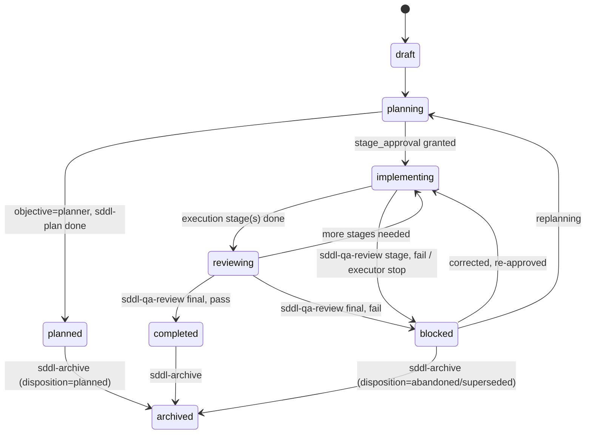

# sdd-lite — Config and State

Other docs: [architecture.md](./architecture.md) · [orchestrator.md](./orchestrator.md) · [flow.md](./flow.md) · [skills.md](./skills.md) · [review-protocols.md](./review-protocols.md)

What `config.schema.yaml` and `state.schema.yaml` govern, and what each of the 5 shared contracts under `skills/_shared/` covers. This is the persistence reference other docs link back to instead of repeating.

## `config.yaml` — project-scope configuration

Generated by `sddl-init` at `./sdd-lite/openspec/config.yaml`, validated by `schemas/config.schema.yaml`. One file per project; never per change.

| Section | Content |
|---|---|
| `version` | schema version string |
| `project` | `name`, `slug`, `root`, `package_root`, `runtime_root` (fixed `./sdd-lite`), `stack` (languages, frameworks, runtime, package manager) |
| `paths` | canonical paths — most are JSON Schema `const` values (`./sdd-lite/...`), not user-configurable; `reviews_root`/`archive_root`/`delivery_root` are optional |
| `quality_commands` | arrays of command strings for `install`, `test`, `build`, `lint`, `typecheck` (required), `format`/`dev` (optional) |
| `bootstrap` | metadata: `status` (`created`/`refreshed`/`already_usable`), `strategy` (fixed `shallow-high-signal`), timestamps, refresh flags, observed files/paths |
| `conventions` | `persisted_language: en` (fixed), `chat_language` (`es`/`en`), `chat_language_source`, `asks_only_when_material` |
| `archive` | optional: `suggest_threshold`, `stale_days` |
| `delivery` | optional: `base_branch`, `pr_suggest_min_commits`, `output_language` |
| `ai_setups` | result of `sddl-init` steps 4-7: `detected`, `configured` (`claude_code` / `agents`), `skills_installed`, `agents_installed` (adapter copies: target + `method: copy` + profiles), `wrappers_injected` |
| `execution_profiles` | optional per-profile `claude` / `codex` `model` and `effort` overrides; absence keeps `templates/agents` defaults; Codex `model: inherit` omits the generated TOML `model` key while effort remains independent |
| `metadata` | `bootstrap_version`, `package_mode: lite` (fixed), `planner_terminal_skill: sddl-plan` (fixed), `final_closure_skill: sddl-qa-review` (fixed) |

**Runtime-convention thresholds, not schema defaults.** The schema only constrains `suggest_threshold` and `stale_days` to be positive integers — it does not declare a JSON Schema `default`. The values commonly cited (`archive.suggest_threshold: 15`, `archive.stale_days: 30`, `delivery.pr_suggest_min_commits: 3`) are conventions the skills themselves fall back to when the field is absent from `config.yaml`, not something the schema enforces or auto-fills. If you need a different threshold, set the field explicitly in `config.yaml` — omitting it relies on the skill's hardcoded fallback, which could change between package versions.

See `templates/bootstrap/config.yaml` for a filled example.

## `state.yaml` — per-change resume anchor

One per active change at `./sdd-lite/openspec/changes/{change-name}/state.yaml`, validated by `schemas/state.schema.yaml`. This is operational memory — lifecycle, resume, checkpoints, decisions — not a substitute for the semantic detail that lives in the stage artifacts themselves (`proposal.md`, `spec.md`, etc.).

### Lifecycle status transitions



Only `sddl-qa-review` in `final` mode may set `completed`. Only `sddl-archive` may set `archived`, and only inside the archived copy of `state.yaml` — the historical record.

### Other top-level fields

| Field | Purpose |
|---|---|
| `objective` | `new-feature` \| `bug-fix` \| `planner` \| `refactor-rework` |
| `complexity_assessment` | `route` (`continue-lite`/`macro-plan-first`/`escalate-to-sdd-v2`), `summary`, `confidence`, `recorded_at` |
| `current_stage` | which of the 11 stage ids (or `none`) is active |
| `stages` | per-stage `status`: `pending`/`in_progress`/`completed`/`blocked`/`skipped` |
| `artifacts` | canonical paths for every artifact this change has produced |
| `checkpoints[]` / `decisions[]` | full audit trail of every checkpoint raised and how the user resolved it |
| `open_risks[]` | active risks with `severity`: `low`/`medium`/`high`/`critical` |
| `qa_summary` | mode, verdict, summary, report path — from the latest `sddl-qa-review` run |
| `review_summary` | mode (`4r`/`judgment-day`), verdict, round, bucket counts, ledger path |
| `delivery_summary` | modes run, output language, recorded commit SHAs |
| `next_action` | `kind` (`run_stage`/`ask_user`/`wait_for_approval`/`complete`/`halt`/etc.) plus a summary |

## The 5 shared contracts (`skills/_shared/`)

Each fixes one facet of shared vocabulary so the 12 skills do not diverge independently. Skills read these as a fallback only — the preferred path is that the orchestrator already injected the relevant compact rules into the handoff (see [orchestrator.md](./orchestrator.md)).

| Contract | Covers |
|---|---|
| `sddl-flow-contract.md` | canonical objective/route/stage/lifecycle ids, worker handoff controls, the context recovery ladder, the common result-contract field shape (`status`, `executive_summary`, `artifacts`, `next_action`, `open_risks`, plus optional fields), and the flow rules that bind stage order and terminal behavior |
| `sddl-persistence-contract.md` | the canonical runtime file layout, `change-name` kebab-case rule, per-artifact ownership tables (project-scope, change-scope, standalone review/delivery, archive), and artifact budget guidance (word-count targets per artifact) |
| `sddl-project-standards-contract.md` | the persisted-English / chat-flexible language rule, how project standards categories (stack, structure, commands, conventions) are represented, the `skill-catalog.md` compact-injection protocol, and source-of-truth precedence when standards conflict |
| `sddl-review-ledger-contract.md` | the findings row shape (`location`, `severity`, `claim`, `evidence_class`, `causal_disposition`, `proof_refs`), the severity model, id/status transition rules, convergence buckets, digest rules, and the hard review budgets — shared by both `sddl-code-review` and `sddl-judgment-day`; see [review-protocols.md](./review-protocols.md) for how these rules play out in practice |
| `sddl-user-interaction-contract.md` | the 12 checkpoint types (`stage_approval`, `review_gate`, `archive_review`, `delivery_gate`, etc.), when each is mandatory vs. conditional, its minimum content, and how `state.yaml` should record checkpoints/decisions |

## Runtime file layout at a glance

```text
./sdd-lite/
  project-context.md          # sddl-init
  skill-catalog.md             # sddl-init — runtime standards registry
  openspec/
    config.yaml                 # sddl-init
    changes/{change-name}/
      state.yaml                # orchestrator + active stage
      proposal.md spec.md design.md plan.md execution-log.md qa-report.md
      macro-plan.md             # only on approved macro-plan-first
      review-ledger.md          # only if a review protocol ran
      delivery-report.md        # only if sddl-delivery ran
    reviews/{target-slug}/review-ledger.md      # standalone reviews
    delivery/{target-slug}/delivery-report.md   # standalone delivery runs
    archive/{YYYY-MM-DD}-{change-name}/         # closed, planned, superseded
    archive/_discarded/{YYYY-MM-DD}-{change-name}/  # abandoned, manual deletion
```

`archive/` is always a sibling of `changes/`, never a child, so `changes/*/` reliably lists active changes only.
