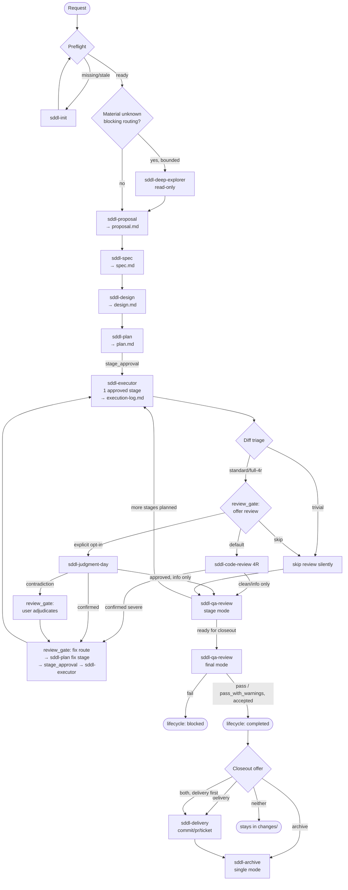
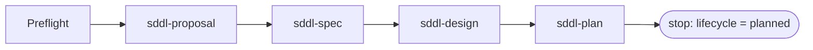
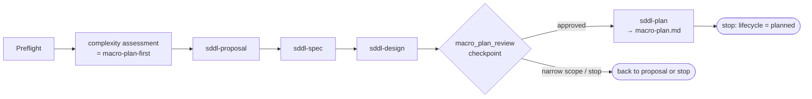
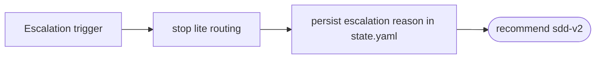

# sdd-lite — Flow

Other docs: [architecture.md](./architecture.md) · [orchestrator.md](./orchestrator.md) · [skills.md](./skills.md) · [review-protocols.md](./review-protocols.md) · [config-and-state.md](./config-and-state.md)

The end-to-end path a change takes, and the three ways it can branch off the standard path. For *why* the orchestrator picks a given branch, see [orchestrator.md](./orchestrator.md). For what each stage actually does, see [skills.md](./skills.md).

## Standard flow (`continue-lite`)



Key ownership per artifact along this path:

- `proposal.md` — problem framing and feasibility signal
- `spec.md` — scope boundary and acceptance criteria
- `design.md` — technical approach and affected areas
- `plan.md` — staged execution plan
- `execution-log.md` — implementation traceability
- `review-ledger.md` — 4R / judgment-day findings and fix-round history (only exists if a review ran)
- `qa-report.md` — review findings and closeout evidence
- `delivery-report.md` / `archive-report.md` — only if those skills ran

The orchestrator routes from digests and metadata in these files before rereading full bodies — see [config-and-state.md](./config-and-state.md).

Launch uses execution profiles, not extra stages: proposal → `sddl-framer`; spec/design → `sddl-architect`; plan → `sddl-sequencer`; archive/delivery → `sddl-light`; deep-explorer → `sddl-explorer`; executor → `sddl-executor`; 4R/judgment-day → `sddl-reviewer`; QA → `sddl-qa`. `state.yaml` still records skill ids.

## Standalone review flows

Both review protocols also run with no active change, triggered directly:

```text
"review this diff/PR"      → sddl-code-review  (triage → lenses → ledger)
"judgment day on X"        → sddl-judgment-day  (2 blind judges → convergence → verdict)
```

These persist only `./sdd-lite/openspec/reviews/{target-slug}/review-ledger.md`. If a standalone review confirms severe findings, the orchestrator suggests opening a change (mini or full) seeded from the ledger — it never fixes directly. Details in [review-protocols.md](./review-protocols.md).

## `planner` flow

Formalize and plan only; no execution ever starts.



`sddl-plan` is the terminal stage for `objective: planner`. `next_action` never auto-routes to execution or QA. A `planner` change is archivable once it reaches `planned` (`disposition: planned`) — this is a deliberate divergence from `sdd-v2`, where planner changes never archive.

## `macro-plan-first` flow

Used when work still fits lite but must be decomposed before execution is safe to approve.



`macro-plan.md` is never written before the `macro_plan_review` checkpoint is explicitly approved. This route does not silently downgrade back to `continue-lite`, and it stays intentionally non-executable until a later, separate approval starts implementation.

## Escalation flow

Triggered when the request behaves like a migration, large redesign, or repo-wide coordination problem — at initial complexity assessment or at any later stop-condition check.



The lite state keeps recording the escalation route rather than pretending the work is still safely executable in lite; nothing in the lite change is deleted.

## Delivery and archive, in the flow

`sddl-delivery` and `sddl-archive` are not stages in the proposal→plan→execute chain — they act on a change *after* `sddl-qa-review` final mode, or standalone (delivery over a bare commit range, archive in batch mode for cleanup). Neither one is a quality gate:

- `sddl-delivery` drafts commit/PR/ticket text only; it never runs git, never calls a tracker, never touches `lifecycle_status`. It can read from an active change or an already-archived one — archiving first never blocks drafting delivery for that change later.
- `sddl-archive` moves a change's folder into `archive/`; it trusts the QA verdict as-is and never re-reviews. It never archives a `fail` verdict.

Full mode details (`commit`/`pr`/`ticket`, `single`/`batch`) are in [skills.md](./skills.md).
