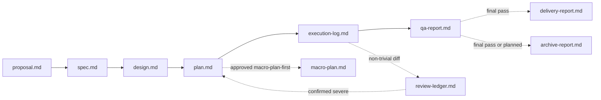

# sdd-lite — Skills

Other docs: [architecture.md](./architecture.md) · [orchestrator.md](./orchestrator.md) · [flow.md](./flow.md) · [review-protocols.md](./review-protocols.md) · [config-and-state.md](./config-and-state.md)

Reference for each of the 12 canonical skills under `skills/sddl-*/`. For where each one sits in the overall flow, see [flow.md](./flow.md). For the two review skills specifically, see [review-protocols.md](./review-protocols.md) — they are summarized here only briefly.

## Summary table

| Skill | Role | Primary writes | Modes |
|---|---|---|---|
| `sddl-init` | Bootstrap the repo and install AI setup | `project-context.md`, `skill-catalog.md`, `config.yaml`, AI setup files | — |
| `sddl-proposal` | Idea consolidation, optional lightweight exploration | `proposal.md`, `state.yaml` | — |
| `sddl-spec` | Formal functional spec, firm scope boundary | `spec.md`, `state.yaml` | — |
| `sddl-design` | Technical design, affected areas | `design.md`, `state.yaml` | — |
| `sddl-plan` | Staged execution plan | `plan.md`, `state.yaml`, `macro-plan.md` when approved | — |
| `sddl-executor` | Execute one approved stage | repo files in scope, `execution-log.md`, `state.yaml` | — |
| `sddl-code-review` | 4R diff review protocol | `review-ledger.md` (orchestrator-written) | triage tier |
| `sddl-judgment-day` | Opt-in adversarial dual review | `review-ledger.md` (orchestrator-written) | `code` / `artifact` |
| `sddl-deep-explorer` | Bounded read-only analysis | none by default | — |
| `sddl-qa-review` | Stage review or final closeout | `qa-report.md`, `state.yaml` | `stage` / `final` |
| `sddl-delivery` | Draft commit/PR/ticket text | `delivery-report.md`, `state.yaml` | `commit` / `pr` / `ticket` |
| `sddl-archive` | Move finished/planned/abandoned changes to archive | `archive/{date}-{change}/archive-report.md` | `single` / `batch` |

## Artifact dependency chain

## `sddl-init`

**Purpose.** Prepare durable bootstrap context under `./sdd-lite/` and install the package into the host AI setup (`claude_code`, `agents`, or none). Shallow and high-signal — it bootstraps, it does not deeply explore.

**Inputs.** Top-level manifests, lockfiles, build/test/lint/typecheck config, maintained docs, existing bootstrap files if present, plus a bounded convention sample (step 3).

**Convention scan (step 3).** A bounded pass — at most 6 files beyond the shallow scan — over contributor docs, executable style config, and 2-3 representative source/test files. It records naming and file placement, layering, testing style, and error handling, but only when a pattern repeats or is fixed by executable config; anything unsettled within the budget is written as `not established`. Results land in the `Conventions` table of `project-context.md` and, distilled to at most 6 bullets, in `### project_conventions` of `skill-catalog.md` — the section the orchestrator injects into delegated stage prompts.

**Outputs.** `project-context.md`, `skill-catalog.md` (the runtime standards registry — see [config-and-state.md](./config-and-state.md)), `openspec/config.yaml`; optionally skill installation (`.claude/skills/` or `.agents/skills/`, symlink or copy), execution-profile adapters (`.claude/agents/` or `.codex/agents/`, always copy), and wrapper injection into `CLAUDE.md`/`AGENTS.md` between `<!-- sdd-lite:start -->`/`<!-- sdd-lite:end -->` markers (contract `0.4`).

**Preflight states.** `ready` (continue) · `stale` (continue if non-material) · `incomplete`/`missing` (stop, run `sddl-init`).

## `sddl-proposal`

**Purpose.** First canonical change stage — consolidates the user's idea into problem framing, an initial scope sketch, and a feasibility signal, before investing in formal specification. Initializes `state.yaml`.

**Optional lightweight exploration.** Up to 10 high-signal files when the request is vague or needs current-architecture context to even frame the problem. The budget belongs to this worker and is unrelated to the orchestrator's own 4-file delegation rule. It recommends `sddl-deep-explorer` only when a specific unknown blocks framing — not when the file count grows.

**Readiness gates.** Before writing the artifact it runs three gates — `Contradiction`, `Insufficient context`, `Ambiguous framing` — each recorded in the `Readiness Check` table with a verdict of `clear`/`raised`/`resolved` and, when it fired, a severity of `low`/`medium`/`high`. A precision gate keeps speculative findings out. When a gate needs the user, it asks inline as a single block of at most 5 questions (checkpoint type `missing_context`), rather than guessing or bouncing through `sddl-deep-explorer`.

**The artifact is written on every path.** Asking shapes what goes into `proposal.md`; it never replaces writing it. This is what makes a change interrupted at a gate resumable from disk instead of from chat memory — a non-`ready` artifact records which gate fired, what was asked, and what remains, and marks undetermined sections as pending rather than padding them.

| `proposal_status` | Result `status` | What the orchestrator does |
|---|---|---|
| `ready` | `success` | routes to `sddl-spec` |
| `needs-input` | `partial` | surfaces `decision_required`, waits, re-routes to `sddl-proposal` |
| `blocked` | `blocked` | surfaces the blocking reason immediately |

**Inputs.** `config.yaml`, `project-context.md`, `skill-catalog.md`, prior `proposal.md`/`state.yaml` on rerun.

**Outputs.** `proposal.md` (200-400 words target, `proposal_status` one of `ready`/`needs-input`/`blocked`), `state.yaml`.

**Stop rule.** Never produces definitive scope boundaries or acceptance criteria — that is `sddl-spec`'s job.

## `sddl-spec`

**Purpose.** Turns `proposal.md` into a formal contract: firm scope boundary (in/out/non-goals), expected behavior, acceptance criteria, risks.

**Inbound contract.** Three fields of `proposal.md` are preconditions. It formalizes only when `proposal_status` is `ready`, and returns `blocked` on `needs-input`/`blocked` or on a `Readiness Check` gate left `raised` at `high`. Every row of `Open Questions For Spec` is migrated into `Open Questions And Decisions` — resolved where evidence allows, otherwise given a `Needed Before` of `design` or `execution`. A question the user skipped is never treated as an implicit answer.

**Proportional spec.** The minimal shape (scope boundary and acceptance criteria only) is allowed when all three readiness gates are `clear` *and* the scope sketch touches a single surface. Anything else gets the full artifact, so two runs over the same proposal reach the same shape.

**Inputs.** `proposal.md` as primary source of truth including its status, readiness table, and open questions; `config.yaml`, `project-context.md`.

**Outputs.** `spec.md` (300-500 words target), `state.yaml`.

**Stop rule.** Does not redefine the problem (already framed by `sddl-proposal`) and does not become a technical design.

## `sddl-design`

**Purpose.** Turns `spec.md` into a practical technical approach: affected modules/interfaces/data, architecture decisions, alternatives. Proportional to complexity.

**Inbound contract.** Every row of the spec's `Open Questions And Decisions` must land somewhere. Rows with `Needed Before: design` are owned here — resolved with current evidence, or returned as `partial`/`blocked` rather than designed around. Rows with `Needed Before: execution` are carried into `Open Technical Questions` with that value intact, so `sddl-plan` can surface them for the stage they affect. A row never disappears without a resolution or a carry-forward.

**Proportional design.** The minimal shape (approach and affected areas only) requires all three: no unresolved `Needed Before: design` row, a single-surface in-scope boundary, and no active `open_risks` at `medium` severity or above. A single surface can still carry high technical impact, which is why the risk condition is separate.

**Inputs.** `spec.md` as primary source of truth including its `Open Questions And Decisions`, `proposal.md` as reference.

**Outputs.** `design.md` (400-600 words target), `state.yaml`.

**Stop rule.** Does not redefine scope/acceptance criteria and does not produce a stage-by-stage execution plan.

## `sddl-plan`

**Purpose.** Turns `design.md` into a directly executable, ordered stage plan with dependencies, validation notes, and approval boundaries. Terminal stage for `objective: planner`.

**Inbound contract.** Each `Needed Before: execution` row from the design's `Open Technical Questions` is recorded in `Approval Notes`, naming the stage it affects, so it sits in the plan's own approval context. This stage surfaces them; it does not resolve them and does not block on them. A `Needed Before: design` row arriving still open means the design is incomplete — return `blocked` rather than planning around a decision that was never made.

**Inputs.** `design.md` as primary source of truth including its `Open Technical Questions`; on a fix-stage request, also `review-ledger.md` for the confirmed finding ids.

**Outputs.** `plan.md` (300-500 words target), `state.yaml`; `macro-plan.md` only on an approved `macro-plan-first` route.

**Fix stage requests.** Appends one bounded fix stage scoped exactly to the confirmed ledger ids — never rebuilds the whole plan.

**Stop rule.** Never implements or executes; never absorbs QA logic.

## `sddl-executor`

**Purpose.** Executes exactly one approved `plan.md` stage per invocation. Does not auto-advance into the next stage.

**Preconditions.** `proposal.md`/`spec.md` still match approved direction, `plan.md` has a usable stage plan, objective is not `planner`, route is not `macro-plan-first`, the specific stage has explicit approval.

**Stop rules.**

| Condition | Meaning |
|---|---|
| Contradiction | approved artifacts and reality materially disagree |
| Scope drift | requested/discovered work changes the intended outcome |
| Blast-radius expansion | safe completion requires touching files/modules outside approved scope |

**Outputs.** Repo files inside approved scope, `execution-log.md`, `state.yaml`. Never writes `qa-report.md`, never commits/stashes/rebases, never stages files (`git add` belongs to the orchestrator only).

**QA handoff.** Recommends (never auto-runs) `sddl-qa-review` when the stage touched code non-trivially, hit a meaningful checkpoint, surfaced warnings, or the user asks.

## `sddl-code-review` and `sddl-judgment-day`

Orchestrator-executed review protocols, not linear stages — the orchestrator freezes the target, launches read-only lens/judge workers, and writes `review-ledger.md` itself. See [review-protocols.md](./review-protocols.md) for the full triage rubric, severity model, and fix routing.

## `sddl-deep-explorer`

**Purpose.** Resolves one material unknown blocking safe routing or the next approved stage. Strictly read-only, bounded to that one question.

**Inputs.** Bootstrap files, current change artifacts, targeted repo files, tests, configs, or docs directly related to the unknown.

**Outputs.** None persisted by default — a bounded answer distinguishing observed facts, grounded inferences, and remaining unknowns, plus a route recommendation (`continue-lite` / `macro-plan-first` / `escalate-to-sdd-v2` / return to the interrupted stage).

**Stop rule.** Never writes runtime files or touches code; never redefines approved scope; never substitutes for a necessary user decision.

## `sddl-qa-review`

**Purpose.** The single QA skill, unifying incremental review and final closeout via two modes.

| Mode | Use when | Closeout effect |
|---|---|---|
| `stage` | a stage reached a meaningful checkpoint, or the user asks for review before the next stage | never marks `completed` |
| `final` | implementation is complete and the user wants closeout | only mode that may set `lifecycle_status: completed`, and only on a clean `pass` |

**Inputs.** All change artifacts plus `review-ledger.md` when a review protocol ran — its verdict and open severe findings must be reflected in the QA verdict, never closed over.

**Verdicts.** `pass` / `pass_with_warnings` / `fail`. `final` + `pass_with_warnings` keeps the change in `reviewing` pending a `final_review` checkpoint decision; `final` + `fail` sets `blocked`.

**Outputs.** `qa-report.md` (300-500 words stage / 500-800 words final), `state.yaml`. Never edits code, never archives, never drafts delivery text.

## `sddl-delivery`

**Purpose.** Drafts the commit message, PR description, and ticket content for work already done. Drafts only — never runs a git write command, never calls a tracker, never changes `lifecycle_status`. It reports the QA verdict; it does not form its own quality judgment.

| Mode | Produces | Notes |
|---|---|---|
| `commit` | one commit message | on request only, never offered proactively; records the SHA if the user confirms they applied it |
| `pr` | pull request description | grouped by concern, no exhaustive file table |
| `ticket` | corrected description + evidence + test steps + status | derives status from `qa_summary`/`open_risks`, never from impression |

**Targets.** A named change (`changes/` then `archive/`), the active change by default, or — standalone — a resolved commit range correlated against known changes via a fixed rubric (`exact`/`confirmed`/`strong`/`moderate`/`weak`/`no-match`). Only `exact` correlations may be preselected; everything else needs an explicit user decision through the interactive selection loop (`all | none | 1,3 | 1-4 | inspect N | done`).

**Gate.** One `delivery_gate` checkpoint per run, before drafting anything: modes, frozen target, correlation class, output language (`en`/`chat`/`es`/`mixed`, or fixed via `delivery.output_language` in `config.yaml`).

## `sddl-archive`

**Purpose.** Bookkeeping, not a second quality gate — moves changes out of `changes/` once they no longer belong there, trusting the QA verdict as-is.

| Disposition | Meaning | Destination |
|---|---|---|
| `closed` | finished, QA final passed | `archive/` |
| `planned` | `planner` objective ended at `planned` | `archive/` |
| `abandoned` | work stopped, will not continue | `archive/_discarded/` |
| `superseded` | replaced by another change | `archive/` |

| Mode | Use when |
|---|---|
| `single` | one change, via the closeout offer or direct request |
| `batch` | interactive triage of every candidate (`all | none | 1,3 | 1-4 | inspect N | skip N | done`) |

**Classification rubric** runs over `lifecycle_status`, QA verdict, and age (`archive.stale_days`, default 30). Only `ready` candidates are ever preselected. A `fail` QA verdict is never archived.

**Hard rules.** Never deletes (abandoned changes wait in `_discarded/` for manual deletion), never merges (related changes are cross-referenced via `related_changes` only), never moves anything without a recorded per-change decision.
