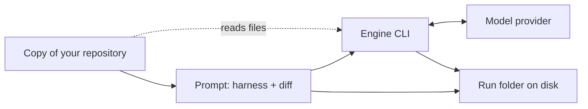

# Design

## Routing Digest

- change_name: e7-f2-h1-user-docs
- route: continue-lite
- digest_summary: >-
  Three flat docs written to fixed outlines (below), one Mermaid diagram in total (privacy
  data flow), a links-only README section, and a fixed harness example `my-review`
  (harness.md + skills.yaml + output.md with the VERDICT line last + user skill
  `house-rules`). Verification is two scratch scripts kept in the change dir
  (`verify-quickstart.sh`, `verify-verdict.mts`) that run in a sandbox under the
  scratchpad with no engine on PATH. D5 = last_line (d-011), D6 = note_only (d-012).
- affected_areas: `docs/quick-start.md`, `docs/build-your-own-harness.md`, `docs/privacy.md` (new); `README.md` (one inserted section); change-dir scripts. Nothing else.

## Summary

- status: success. All `Needed Before: design` rows resolved; F1-F7 carried to execution.

## Design Overview

Each doc = H1, one-line purpose (italic-free plain sentence), `## 1. ...` numbered
sections, `## Next steps` with 1-2 links. No TOC. One command per fenced block
(`bash`), placeholders `<owner/repo>`, `<branch>`, `<url>`, `<id>` explained once in the
quick start. Home folder is written `~/.sentinel` with one sentence (quick start step 3)
that `SENTINEL_HOME` replaces it; the other docs say "your sentinel folder
(`~/.sentinel`)" and link back. Install text appears only in the quick start; data flow
only in privacy (AC-5).

### Quick start — `docs/quick-start.md`

Title `Quick start`. Purpose: "Install sentinel, register a repository and review your first branch." Mermaid: none (steps are linear; the flow diagram lives in privacy).

| § | Heading | Content / commands | CF |
|---|---|---|---|
| 1 | Before you start | Node 22+, git, one engine CLI installed and logged in (Claude Code `claude` or OpenCode `opencode`). `node --version` | CF-5 |
| 2 | Install | Single isolated section (#45 swaps it): `git clone https://github.com/nico0695/sentinel-kit.git` · `cd sentinel-kit` · `npm ci` · `npm run build` · `npm install -g .` · `sentinel --help`; one sentence: also installed as `snt`; factory harnesses `quick`, `pr-review`, `security` included | CF-2 |
| 3 | Add a repository | `sentinel repo add <url>` → prints `<owner/repo>  registered`; `sentinel repo list`. Sentences: alias = last two URL parts; sentinel keeps its own copy in `~/.sentinel/clones/`; `SENTINEL_HOME` moves the whole folder; `--harness <name>` sets a default harness on first add; adding again changes nothing | CF-1, CF-3 |
| 4 | Review a branch | `sentinel review <owner/repo> <branch> --type quick`; output = `key<TAB>value` lines, read `state`, `verdict`, `runDir`; no `--type` and no default → error naming `--type`. D6 sentence (see resolutions) | CF-4, CF-12 |
| 5 | Read the result | `sentinel runs list <owner/repo>` · `sentinel runs show <owner/repo> <id>`; the `runDir` folder holds `result.md` (the engine's answer), `prompt.md` (what was sent, link privacy), `metadata.json`; if `state` is not `ok`, `failureStage`/`failureMessage` say why | CF-13 |
| 6 | Choose the engine | `sentinel review <owner/repo> <branch> --type quick --engine opencode`; `export SENTINEL_OPENCODE_MODEL=<provider/model>` (example value from the CLI's own error: `anthropic/claude-sonnet-4`); default in `~/.sentinel/config.yaml`: `defaultEngine: opencode` (YAML block, create the file if absent); claude-code is the default | CF-5 |
| 7 | Interactive mode | `sentinel` on a terminal walks repository → branch → harness → confirm; it needs a terminal, so scripts and CI use `sentinel review`; exit codes: `sentinel review --help` | CF-16, CF-17 |
| — | Next steps | [Build your own harness](build-your-own-harness.md) · [What sentinel sends and stores](privacy.md) | |

### Harness guide — `docs/build-your-own-harness.md`

Title `Build your own harness`. Purpose: "Write your own review instructions and run them with `sentinel review --type`." Mermaid: none (prompt composition is one sentence; a diagram would repeat privacy's).

| § | Heading | Content / commands | CF |
|---|---|---|---|
| 1 | How a harness works | Folder name = `--type` value. Lives in `~/.sentinel/harnesses/<name>/`. Small table: `harness.md` required (instructions); `output.md` optional (answer format; without it nothing asks for a verdict and the review usually ends `ambiguous`); `skills.yaml` optional (list of skills). Skills = `~/.sentinel/skills/<name>.md` or factory `code-quality`, `security`. Same name as a factory harness or skill → yours is used. sentinel sends harness.md, then the skills, then output.md, then the diff | CF-6, CF-8, CF-10 |
| 2 | Create the folders | `mkdir -p ~/.sentinel/harnesses/my-review` · `mkdir -p ~/.sentinel/skills` | CF-1 |
| 3 | Write the instructions | `harness.md` content (below) | CF-6 |
| 4 | Add a skill | `skills/house-rules.md` + `skills.yaml` content; `skills:` must be a list when the file exists | CF-6 |
| 5 | Ask for a verdict | `output.md` content; rule: last line exactly `VERDICT: approve`, `VERDICT: request-changes` or `VERDICT: comment`, lowercase, alone, no formatting; "sentinel looks for it at the end of the answer, so keep it last" | CF-9 |
| 6 | Use it | `sentinel review <owner/repo> <branch> --type my-review`; default for a repo: `sentinel repo add <url> --harness my-review` on first add, else add `defaultHarness: my-review` under the repository's entry in `~/.sentinel/repos.yaml` (YAML snippet with the alias key and a `# keep the existing lines` comment) | CF-3, CF-4 |
| 7 | Check it is picked up | Run `sentinel`, pick repository and branch: `my-review` is in the harness list; press Ctrl+C → "Review cancelled — nothing was run." Every review loads every harness: one broken harness folder stops all reviews with `state validation-failed`, `failureStage harness` and a message naming the file — fix or delete that folder. A misspelled `--type` gives `Harness not found: <name>` | CF-6, CF-7, CF-16 |
| — | Next steps | [Quick start](quick-start.md) · [What sentinel sends and stores](privacy.md) | |

`extraSkills` and `contextMode` are not mentioned (d-007; `contextMode` defaults to `inline`).

### Privacy — `docs/privacy.md`

Title `What sentinel sends and stores`. Purpose: "Know what leaves your machine during a review and what stays on your disk."

| § | Heading | Content | CF |
|---|---|---|---|
| 1 | What is sent | The prompt: harness instructions, skills, answer format, the diff of the branch against its base, plus the output of validation commands if the repository entry declares any (clause only, not explained). It goes to the engine CLI you chose, which sends it to its model provider under that tool's own account and settings. Mermaid here | CF-8, CF-5 |
| 2 | What the engine can read | Runs inside a temporary checkout of the reviewed branch and can read files there. OpenCode: sentinel blocks file edits, shell commands and web fetches. Claude Code: runs `claude -p --model sonnet` with Claude Code's own permission settings; sentinel adds no limit | CF-14 |
| 3 | What stays on your disk | `~/.sentinel/clones/` full copy of each repository; one folder per review under `~/.sentinel/runs/` (the `runDir` printed) with `metadata.json`, `prompt.md` (contains the diff), `result.md` when the engine answered, `validations/` when checks ran; kept for every review, whatever the outcome, until you delete them | CF-1, CF-13 |
| 4 | What sentinel itself sends | Only git traffic: cloning at `repo add` and fetching in interactive mode. No telemetry, no other network calls | CF-15, CF-12 |
| 5 | Credentials | sentinel stores none; git uses your git credentials; the engine uses its own login | CF-15 |
| — | Next steps | [Quick start](quick-start.md) · [Build your own harness](build-your-own-harness.md) | |

Mermaid (5 nodes, no styles):



## Harness Example (exact doc content)

Folder `~/.sentinel/harnesses/my-review/`. Files as they appear in the guide:

`harness.md`

```markdown
## Role

You review a pull request diff for this team. Report only problems that would
block a safe merge: bugs, missing error handling, and changes that break the
house rules below.

Review only the lines in the diff. Name the file and line for every finding.
```

`skills.yaml`

```yaml
skills:
  - house-rules
```

`~/.sentinel/skills/house-rules.md`

```markdown
# House rules

- Code that can fail reports a clear error; no empty catch blocks.
- No passwords, tokens or keys in code, config or tests.
- New behavior comes with a test in the same change.
```

`output.md`

```markdown
## Answer format

List each finding on its own line:

- <file>:<line> — what is wrong and how to fix it.

If there are no findings, write: No findings.

The last line of your answer must be exactly one of these, alone, with
nothing after it and no formatting:

    VERDICT: approve
    VERDICT: request-changes
    VERDICT: comment

Use request-changes if any finding blocks the merge, comment if all findings
are minor, and approve if there are none.
```

Code check: loader accepts it (harness.md present; `skills.yaml` matches `HarnessSkillsSchema`, `contextMode` defaults `inline`; `house-rules` resolves from the user skills dir — `harness-loader-fs.ts`, `load-harnesses.ts`). The marker regex `^VERDICT:\s*(approve|request-changes|comment)$` on a trimmed line, tail window last 30 lines / 2000 chars (`builtin-verdict-extraction.ts:22-26`) matches a final line; the indented lines live in the prompt, not the answer, so they never reach the parser.

## Interfaces, Data, And State

- README (`README.md`): insert immediately before `## Quick start (development)` (line 22), nothing else changed:

```markdown
## Using sentinel

- [Quick start](./docs/quick-start.md) — install sentinel and review your first branch.
- [Build your own harness](./docs/build-your-own-harness.md) — write your own review instructions.
- [What sentinel sends and stores](./docs/privacy.md) — what leaves your machine and what stays on disk.

```

- Verification artifacts (executor writes them in the change dir; sandbox state only in the scratchpad):
  - `verify-quickstart.sh <sandbox-dir>`: `set -euo pipefail`; resolve `node`, `npm`, `git` paths first, symlink them into `$SB/shim`; `export PATH="$SB/prefix/bin:$SB/shim:/usr/bin:/bin" SENTINEL_HOME="$SB/home" npm_config_prefix="$SB/prefix" GIT_CONFIG_GLOBAL="$SB/gitconfig"` (identity set there). `claude` lives only in `/opt/node22/bin`, which is no longer on PATH; the script asserts `! command -v claude && ! command -v opencode` at start and before each review (AC-10). Doc commands run literally, with `~/.sentinel` → `$SENTINEL_HOME` and the GitHub URL → `git clone --branch <current branch> /home/user/sentinel-kit`. Each step logs command, exit code, stdout/stderr to `$SB/log/`.

| Step | Action | Expected |
|---|---|---|
| V1 | Bare origin `$SB/origin/acme/widget.git` (main + `feature/greeting`, pushed from a seed repo) | two branches |
| V2 | Install: clone, `npm ci`, `npm run build`, `npm install -g .` | `sentinel`, `snt` in `$SB/prefix/bin`; `sentinel --help` exit 0 |
| V3 | Save `--help` of root, `repo add`, `review`, `runs`, `runs list`, `runs show` | reference for AC-7 diff |
| V4 | `repo add file://$SB/origin/acme/widget.git`, twice | `acme/widget registered`, then `already-registered`; `repos.yaml` unchanged on 2nd |
| V5 | `repo list` | one `acme/widget` line |
| V6 | `review acme/widget feature/greeting` | exit 1, message names `--type`, no new run |
| V7 | `review ... --type quick` | exit 2; `state engine-error`, `failureStage engine`, `runDir` with `metadata.json`, `prompt.md` |
| V8 | `--engine opencode` without, then with `SENTINEL_OPENCODE_MODEL` | message names the variable (exit recorded); then `engine opencode`, `engine-error`, exit 2 |
| V9 | `config.yaml` `defaultEngine: opencode`, review without `--engine` | `engine opencode`; file removed after |
| V10 | `runs list acme/widget`, `runs show acme/widget <id>` | one line per run; block with `state engine-error` |
| V11 | Guide steps 2-5 literally; `review ... --type my-review` | `failureStage engine` (not `harness`); `prompt.md` has the harness text, `<skill name="house-rules">`, `<output-contract>` and the last-line rule |
| V12 | Add `defaultHarness: my-review` to `repos.yaml`; review without `--type`. Second origin `acme/gizmo` with `repo add --harness my-review`; review without `--type` | `harness my-review` in both blocks |
| V13 | Empty folder `harnesses/broken`, `--type quick`; then `--type my-reveiw` | `validation-failed`, `failureStage harness`, message about `harness.md`; then `Harness not found: my-reveiw`; folder removed |
| V14 | `sentinel </dev/null` | guidance on stderr, exit 1 |
| V15 | Real `~/.sentinel` absent before and after; `git status` of the repo clean except intended files | isolation holds |

  - `verify-verdict.mts <path-to-builtin-verdict-extraction.ts> <path-to-output.md>`: run with `node --experimental-strip-types` against the sandbox clone's file (type-only import is erased). Asserts output.md contains "last line"; synthetic answer = 40 finding lines (>2000 chars, >30 lines) + final `VERDICT: request-changes` → `request-changes`; control with the verdict first → `null` (documents F5). Non-zero exit on mismatch.
- The interactive harness list (guide §7) cannot be driven without a terminal; it is verified structurally: `listHarnessTypes` is `loadHarnesses(...).keys()` (`container.ts:316`), the same loader V11 exercises.

## Alternatives And Trade-Offs

| Option | Pros | Cons | Decision |
|---|---|---|---|
| Guide check = interactive harness list (A) | No model call, validates every file and skill, uses a shown command | Needs repo + branch selection first | chosen; `--type` run + `prompt.md` kept as a one-line hint |
| Guide check = `--type` run + `prompt.md` | Scriptable | Spends a real review to check a folder | rejected for the user doc; used in V11 |
| Scripts in change dir (A) | QA reruns them; not linted (`biome.json` includes only `src/**`, `e2e/**`), not in `tsconfig` | Committed as sdd-lite evidence | chosen; reads AC-9/AC-12 "scratchpad only / not committed" as "sandbox state and outputs only, no product test code" |
| Mermaid in quick start | Visual | Linear steps; duplicates privacy flow | none |

Resolutions recorded here (A, claude):

- D5 (d-011): output.md asks for the VERDICT as the last line; factory first-line mismatch not mentioned (F5).
- D6 (d-012): spec In Scope text "the D6 refresh guidance" and AC-16 resolve to one sentence in quick start §4, scoped to the command because interactive mode fetches (CF-12): "`sentinel review` works on the copy sentinel downloaded at `repo add`; it does not download changes pushed later." No refresh command; F3 filed.
- CF-13 correction: run folders are `runs/<owner>__<repo>/<id>/` (`run-storage-key.ts`), and `result.md` exists only when the engine answered (`run-store-fs.ts:223`). Docs point at the printed `runDir` and never spell the path.
- CF-6 nuance: when `skills.yaml` exists, `skills:` is required (`harness-schemas.ts`).
- `repo add` prints `<alias>\t<registered|already-registered>\t<localPath>` (`format-repos.ts:84`).

## Open Technical Questions

| Question | Impact | Needed Before |
|---|---|---|
| F1-F7 follow-up issues (drafts below), plus link #16 | AC-19 | execution |
| V8 exit code when the opencode model variable is missing (pre-run error expected = 1) | quick start §6 wording only | execution (record, do not document the code) |

Follow-up drafts (file at PR time):

- F1 `TUI empty-state hint shows a wrong repo add usage` — The hint printed when no repository is registered says `sentinel repo add <alias> <url>`; the command takes only `<url>`. Ref `tui-flow.ts:114`.
- F2 `repo add --local-path fails on a clone without origin unless --base-branch is given` — Default-branch detection reads the origin remote; a local clone without it fails registration. Ref `register-repo.ts`.
- F3 `sentinel review never fetches, so later pushes are not reviewed` — The managed copy stays as of `repo add`; a bare base name resolves to the stale local branch even after interactive mode fetched. User docs state the limit in one sentence. Ref `list-branches.ts:35`, `git-cli.ts`.
- F4 `extraSkills in repos.yaml is parsed but ignored` — The field validates but never reaches `loadHarnesses`; wire it or remove it. Ref `run-review.ts` stage 2, `container.ts`.
- F5 `Factory output contracts ask for the verdict first; the parser reads only the tail` — Long factory-harness answers end `ambiguous`. Align the contracts or the parser (candidate for #42). Ref `builtin-verdict-extraction.ts`, `harnesses/*/output.md`.
- F6 `review --help understates exit code 1` — Usage and pre-run errors also exit 1, not only request-changes. Ref `exit-code.ts`, `review-command.ts`.
- F7 `One broken user harness fails every review` — All harnesses load on every run, so one invalid folder blocks unrelated reviews. Consider loading only the selected harness. Ref `run-review.ts` stage 2.

## Validation Mapping

| AC | Verified by |
|---|---|
| AC-1 | `git diff --stat origin/main` shows exactly the 3 docs + README (+ sdd-lite/history) |
| AC-2, AC-6 | manual read against the outlines above |
| AC-3 | `grep -c '```mermaid'` = 1 (privacy), 0, 0; no `style`/`classDef`/`%%{init` |
| AC-4 | `grep -inwE 'ports?|adapters?|hexagonal|use case|composition root|core|terminal state|worktrees?|pipeline' docs/{quick-start,build-your-own-harness,privacy}.md`; judge hits |
| AC-5 | manual cross-read (install only §2 quick start; data flow only privacy) |
| AC-7 | V3 help texts vs every command/flag/env/path in docs; CF table |
| AC-8 | quick start §2 |
| AC-9 | V1-V15 transcript in execution-log |
| AC-10 | engine-absence asserts in script log; V7/V8 `failureStage engine` |
| AC-11 | V11 |
| AC-12 | `verify-verdict.mts` + output.md grep |
| AC-13 | guide §1, §7 vs CF-6/7; `grep -i extraskills` empty; V13 |
| AC-14 | claim-to-CF table in execution-log |
| AC-15 | quick start §7; V14 |
| AC-16 | quick start §4 sentence (no command to run) |
| AC-17 | `git diff README.md` = one added section |
| AC-18 | `git diff --stat` on excluded paths empty; `npm run check`, `npm test` |
| AC-19 | issue numbers in PR body; d-006 gap disclosed |

## Approval Notes

- User approved entering design. No B/C item raised: all choices are A and recorded above.

## Budget Notes

- Over the 600-word target: the harness example and README lines are exact doc content the executor copies, and the V-table replaces a separate plan for the sandbox.
